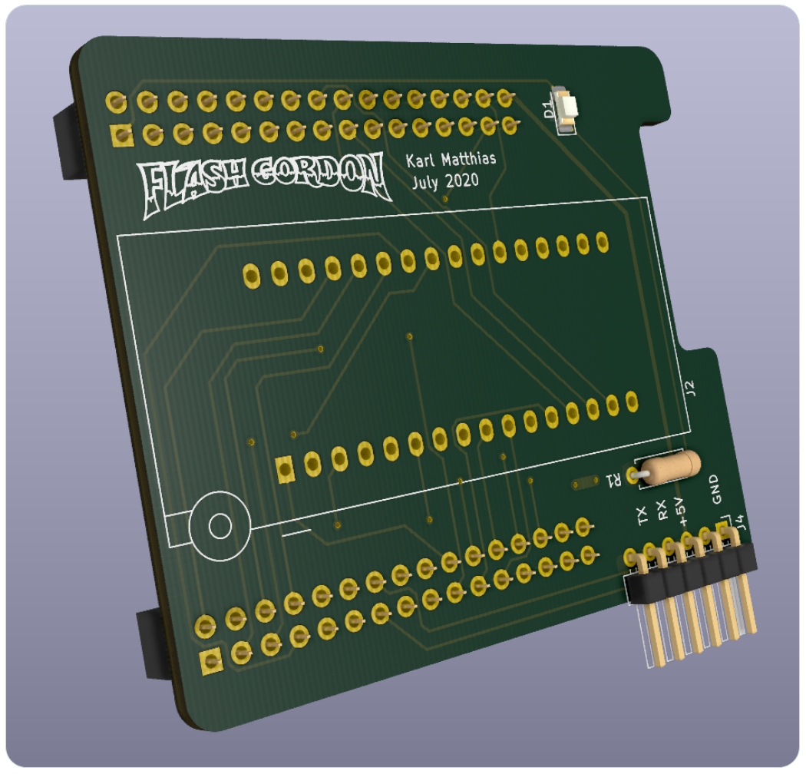
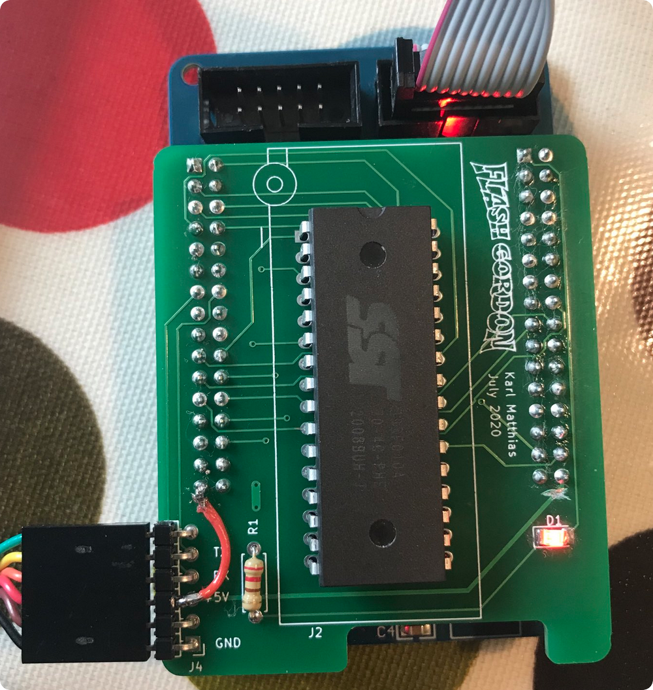

Flash Gordon CLI
================

This is the command line tool for interacting with the Flash Gordon flash
burner that I built. It interacts with the board over serial and can upload,
dump, chip erase, and sector erase 32-pin parallel flash chips such as:

 * SST39SF010A
 * SST39SF020A
 * SST39SF040
 * Am29F010B
 * Am29F020B
 * Am29F040B
 * ... other chips with the same, common pinout

You [can find the software for the hardwire side
here](https://github.com/relistan/flash-gordon-mcu).

The Problem This Solves
-----------------------

I wanted a cheap flash burner that would be useful for writing to common
parallel flash chips for experimenting with old 8-bit CPUs. I wanted it to have
CLI software that runs on macOS easily. I had a couple of ATmega128a boards
around this chip has enough IO ports to support the 32-pin flash chips easily.

Usage
-----
```
usage: flash-gordon-cli [<flags>] <command> [<args> ...]

Flags:
  --help             Show context-sensitive help (also try --help-long and
                     --help-man).
  --serial-port="/dev/cu.usbserial-FTDOMLSO"  
                     The Serial port name/path to use
  --baud-rate=57600  The baud rate of the serial port
  --use-serial       Serial or stdout?

Commands:
  help [<command>...]
    Show help.

  upload [<flags>] [<input-file>]
    Upload a file to Flash Gordon

  dump
    Dump the contents of the flash chip

  erase [<flags>]
    Erase the contents of the whole flash chip
```

The tool currently supports the above commands and a serial port, to be named
as a CLI arg. It defaults to the common location on macOS for an FTDI cable.
You will need to set this to the correct address path for your host. You can
find this in the Arduino console if you don't know how to find it on the
command line.

**Note** that currently `upload` will *do the Intel Hex encoding on the fly* so
you can simply supply the binary in the endianness you want it to have when
written into the chip. The software will encode it and upload it to the board.

I will likely add an `uploadRaw` option to use pre-encoded Intel Hex format
files. This will then better support assemblers and other tools whose native
output format is Intel Hex (e.g Avra assembler).

Hardware
--------

Flash Gordon is a shield that plugs into a common ATmega128a AVR breakout
board. You can often find boards like this on eBay or Aliexpress by searching
for "atmega128a". [Here's one example of the board in
question](https://www.ebay.com/itm/173100806719)

I am working on a second version of the board that will be free of the little
error mentioned in the tweet below on the first version. The software on the
AVR board is written in C and is to be uploaded with the Arduino environment
using [MegaCore](https://github.com/MCUdude/MegaCore).

>I'm working on a
flash burner shield and software for the common ATmega128 breakout board. It
will support the common parallel 32-pin flash DIP pinout for e.g. SST39SF010A
or Am29F010B families (including the larger chips). Just using it as a learning
experience. [pic.twitter.com/QUT4oCoo5p](https://t.co/QUT4oCoo5p) &mdash;
Karl Matthias (@relistan) [July 12,
2020]("https://twitter.com/relistan/status/1282256215960096775?ref_src=twsrc%5Etfw")



>It works! Software I
wrote for the breadboard version just worked. 😁Two little h/w mistakes but
probably not going to worry about it. You can see the bodge wire and cut trace.
Also not quite enough clearance for the power jack on the AVR board so I
removed it (don't need it).
[pic.twitter.com/LKhlerHqjA](https://t.co/LKhlerHqjA)&mdash; Karl Matthias
(@relistan) [July 25,
2020]("https://twitter.com/relistan/status/1287041625605185538?ref_src=twsrc%5Etfw")



Platforms Supported
-------------------

It has been tested on macOS and Linux. It should work on Windows and releases
will include Windows binaries, but I do not have a Windows machine to test
with.
